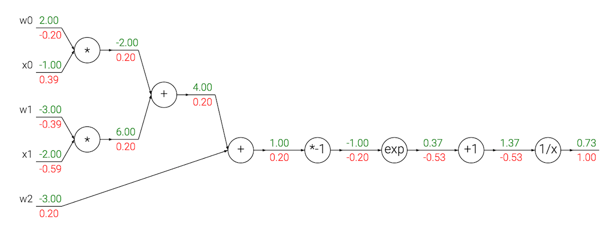
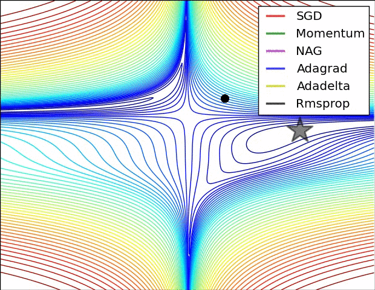
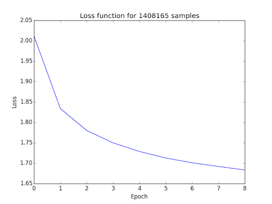

# Spoken Command Processor (miguel)

_[description of the project: its objectives and high-level functionality of this prototype]_

## Transcription Model Architecture (miguel)

_[description and architecture of the model]_

_[backpropagation]_

The transcription model is formed by two submodels: the first maps 20-ms soundbytes to individual phonemes and the second groups those phonemes into words from its dictionary (see `model/__init__.py`). The models are feed-forward neural networks built using the Keras deep learning library, which provides a high-level API to chain layers sequentially.

Once a given neural network's architecture is defined, it is trained using the ubiquitous backpropagation algorithm, which implements the chain rule backwards to incrementally modify the "neurons" so as to reduce the error of the network.


(Source: Stanford University's [CS231n: "Convolutional Neural Networks for Visual Recognition"](http://cs231n.github.io/optimization-2/))

Aside from the number of neurons in the network and the architecture of the layers, the engineer must choose an optimizer. A common choice is Stochastic Gradient Descent (SGD), but there are others that converge at different rates and achieve varying degrees of accuracy depending on the model.


(Source: Stanford University's [CS231n: "Convolutional Neural Networks for Visual Recognition"](http://cs231n.github.io/neural-networks-3/))

### Speech2Phonemes (derek)

#### Architecture

_[arbitrary parameter choices, etc.]_

The first model, "Speech2Phonemes," attempts the task of framewise phoneme classification. The process involves associating a sequence of speech frames to phoneme labels matched to those frames. Ideally, this would be a first step to achieving a speech recognition model able to recognize an arbitrary number of words by piecing together phonemes.

The model used was a multilayer perception, an artificial neural network model often used in machine learning for classification tasks. The model had one hidden layer with 256 sigmoid activation units. A dropout layer was added, which switched off a percentage of the nodes in the network to prevent the domination of a single node and to decouple the influence between nodes, slightly improving accuracy of the model. The output layer had a dimension of 61, as there were 61 phoneme classes found in the dataset. Probabilities for each class was calculated through the final softmax layer.

```
____________________________________________________________________________________________________
Layer (type)                       Output Shape        Param #     Connected to                     
====================================================================================================
dense_1 (Dense)                    (None, 256)         10240       dense_input_1[0][0]              
____________________________________________________________________________________________________
activation_1 (Activation)          (None, 256)         0           dense_1[0][0]                    
____________________________________________________________________________________________________
dropout_1 (Dropout)                (None, 256)         0           activation_1[0][0]               
____________________________________________________________________________________________________
dense_2 (Dense)                    (None, 61)          15677       dropout_1[0][0]                  
____________________________________________________________________________________________________
activation_2 (Activation)          (None, 61)          0           dense_2[0][0]                    
====================================================================================================
____________________________________________________________________________________________________

```

#### Features

_[why the delta MFCC features (as opposed to not delta) + the size of the resulting vectors characterizing 20ms intervals, etc.]_

In order to extract relevant information from the input speech files, we decided to use MFCC feature vectors. MFCCs are commonly used for speech recognition tasks because of its relative accuracy in revealing patterns in human speech. The Mel scale was created to more closely mimic what humans hear, as we are generally better at distinguishing between changes at lower frequencies than at higher frequencies. Expressing the speech signal as a series of vectors is also more ideal for processing the data.

Thirteen MFCC coefficients were chosen for the task, as seemed to be widely used in many implementations of speech recognition models. In addition, delta and delta-delta features (derivatives) corresponding to the thirteen MFCCs were appended to the vector to obtain additional information about the signal. These were calculated using the `librosa` library, through the `librosa.feature.mfcc` and `librosa.feature.delta` functions. The windows sizes and step sizes recommended were 25ms and 10ms, however, due to the smaller length of some uttered phones, the window size was chosen to be a bit smaller at 20ms as a compromise.

With the sampling rate at 16 kHz for all the audio files, samples were less than a millisecond. From analysis of the data, according to the transcription, some phones were smaller than the window size. In addition, the start and end times of the utterances could mean that multiple phones could be represented in a window frame. To resolve this alignment issue, we simply took the phone that occupied the majority of the frame as the label for that frame.

#### Training

As would be expected in training, a loss is calculated for each interval of training (an epoch) which should be minimized in order to obtain more accurate results. As can be seen through the loss function, this gradually decreases, and generally more epochs would result in a better trained model. Obvious constraints for training would be the time it takes to train the model, which makes MLPs slightly easy to deal with (as opposed to RNNs, and other architectures). In addition, overfitting for the training data might occur with too many epochs.



### Phonemes2Text (miguel)

#### Architecture

_[arbitrary parameter choices, etc.]_

The second model, "Phonemes2Text", accepts a series of phonemes and attempts to classify it as any of the words used by the dataset. Like its previous counterpart, it is a feed-forward neural network characterized by a series of dense, sigmoid activation and dropout layers. The output dimension parameter of the first layer, 1500, was determined empirically to give the best results. For 20 epochs, a change in this parameter from 256 to 1500 improved the accuracy by 16.8%.

```
____________________________________________________________________________________________________
Layer (type)                       Output Shape        Param #     Connected to                     
====================================================================================================
dense_1 (Dense)                    (None, 1500)        46500       dense_input_1[0][0]              
____________________________________________________________________________________________________
activation_1 (Activation)          (None, 1500)        0           dense_1[0][0]                    
____________________________________________________________________________________________________
dropout_1 (Dropout)                (None, 1500)        0           activation_1[0][0]               
____________________________________________________________________________________________________
dense_2 (Dense)                    (None, 6102)        9159102     dropout_1[0][0]                  
____________________________________________________________________________________________________
activation_2 (Activation)          (None, 6102)        0           dense_2[0][0]                    
____________________________________________________________________________________________________
dropout_2 (Dropout)                (None, 6102)        0           activation_2[0][0]               
____________________________________________________________________________________________________
dense_3 (Dense)                    (None, 6102)        37240506    dropout_2[0][0]                  
____________________________________________________________________________________________________
activation_3 (Activation)          (None, 6102)        0           dense_3[0][0]                    
====================================================================================================
Total params: 46446108
____________________________________________________________________________________________________
```

#### Features

_[also describe the bridge between Speech2Phonemes and Phonemes2Text]_

The phonemes are provided as a list of class numbers ranging from 0-61 (the total number of phonemes), accompanied by a one-hot vector denoting the word in a vocabulary of 6102 –see the words on `volumes/config/timit_words`. For 39826 series of phonemes –each of which corresponded to one word, the shapes of the matrices used to train the model are as follows:

```
X_train.shape = (39826, 30)
y_train.shape = (39826, 6102)
```

We make the assumption that a word will be composed of at most 30 phonemes, and right-pad the words with fewer phonemes with zeros. This seems valid, given that the longest word in the dataset contained 17 phonemes.

#### Training

_[plot of the loss function, discussion of the number of epochs]_

The neural network was trained on a CPU (a slow process) using 50 epochs. The loss function started off at 5.6256 and, notably, decreased to 0.6436, using the Adam optimizer and a learning rate of 0.001 –a value that was greater by a factor of 10 was attempted to speed up the learning process but, unfortunately, the model did not converge (the loss function sky-rocketed).

```
Epoch 1/50
39826/39826 [==============================] - 186s - loss: 5.6256     
Epoch 2/50
39826/39826 [==============================] - 193s - loss: 4.2672     
...  
Epoch 49/50
39826/39826 [==============================] - 262s - loss: 0.6437     
Epoch 50/50
39826/39826 [==============================] - 264s - loss: 0.6436
```

### End-to-End

_[limitations of tying the whole thing together + improvements]_

The two models were trained independently using data from TIMIT (1.4M and 38K samples, respectively). In order to tie the output from the first (individual phonemes) to the second (groups of phonemes from which words may be classified), a regulation scheme displayed by `model/regulator.py` was developed to remove duplicate phonemes and reduce the impact of the noise. The former algorithm would successfully trim a series e.g. `['a', 'a', 'a', 'b', 'b']` to `['a', 'b']`, and the latter assumed that a correct phoneme would appear at least "a few times" during a 20-ms period wherein one is captured for every frame.

The accuracies of the two models, trained separately, were:
- "Speech2Phonemes": 47.4%
- "Phonemes2Text": 60.7%

This means that, in the first case, a 20-ms clip has a 47.4% chance of being classified as the correct phoneme (out of 61) and, in the second, a series of phonemes has a 60.7% chance of being classified as the correct word (out of 6102). This assumption, however, is not expected to hold for the end-to-end scheme, wherein the inputs to the second model contain non-negligible levels of noise.

#### Sources

_[list of papers and blog posts we relied on for the implementation of the model]_

## Implementation

### Dataset (derek)

_[TIMIT and what it offers in terms of words, phonemes, wavfiles tagged frame-by-frame, sampling rate]_

The TIMIT dataset is an often used corpus developed by MIT, Stanford and Texas Instruments for training and testing automatic speech recognition systems. There are 6300 sentences spoken by 630 speakers (438 male, 192 female) with more than 6000 different words used. Speakers were chosen from 8 dialect regions of the United States, encompassing various geographical sections of the states. The dataset also had a suggested training/testing split, used to partition the data.

The extensive labeling for the dataset made it a favorable one to use, as both phonetic and word labels for the speech files were provided with the data. Using those labels, we were able to perform framewise labeling and use this to train and test the data.

### Keras

_[accessible deep learning library in terms of flexibility and the statistics it provides to gauge training, use of numpy]_

## Command Interpreter

_[description of the bells-n-whistles]_

_[edit_distance algorithm]_
To attempt to match the similarity of strings, an edit distance metric is used. One such metric is the Levenshtein distance, which measures the distance between two words as the minimum number of single-character edits (insertions, deletions and substitutions) needed to go from one string to the other. This can be efficiently implemented through a dynamic programming algorithm.

### Sockets

### Redis (miguel)

_[database used to store and retrieve the user commands]_

### Click (miguel)

_[command-line interface]_
